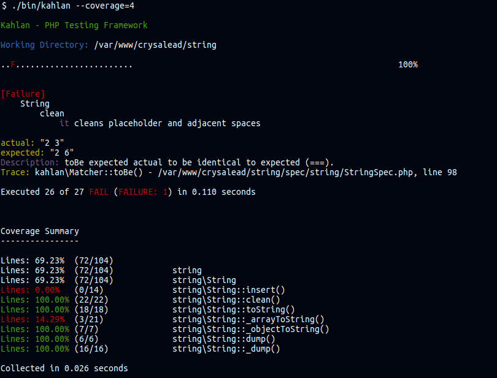

# Kahlan

[](https://travis-ci.org/crysalead/kahlan) [](https://scrutinizer-ci.com/g/crysalead/kahlan/) [](https://scrutinizer-ci.com/g/crysalead/kahlan/) [](https://coveralls.io/r/crysalead/kahlan?branch=master)

Kahlan is a full-featured Unit & BDD test framework a la RSpec/JSpec using the `describe-it` syntax. It embraces the [KISS principle](http://en.wikipedia.org/wiki/KISS_principle) and moves testing in PHP one step forward.

Kahlan embrace the [KISS principle](http://en.wikipedia.org/wiki/KISS_principle) and makes Unit & BDD testing fun again.

**Killer feature:** Kahlan allow to stub or monkey patch your code directly like in Ruby or JavaScript without any required PECL-extentions.

# Documentation

See the whole [documentation here](docs/README.md).

# Requirements

 * PHP 5.4+
 * Using Composer
 * Xdebug if you want to perform code coverage analysis.

# Screenshot

Example of output:


Example of detailed code coverage on a specific scope.


# Installation

```
git clone git@github.com:crysalead/kahlan.git
cd kahlan
composer install
bin/kahlan              # to run specs or,
bin/kahlan --coverage=4 # to run specs with coverage info for namespaces, classes & methods (require xdebug)
```
