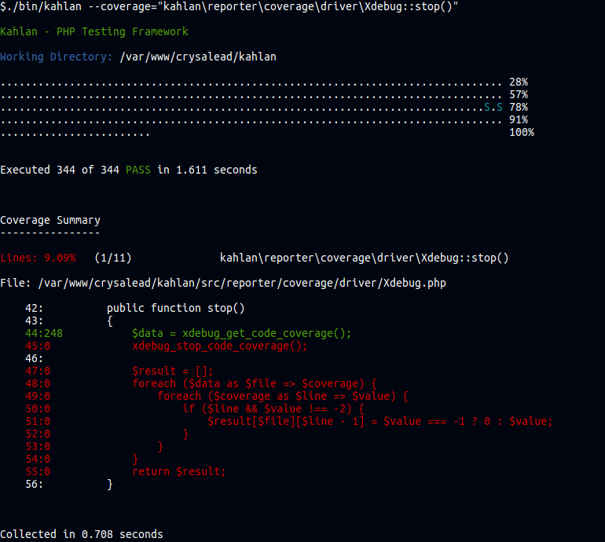

## Pro Tips

### Use the `--ff` option (fast fail)

`--ff` is the fast fail option. If used, the test suite will be stopped as soon as a failing test occurs. You can also specify a number of "allowed" fails before stopping the process. For example:

```
./bin/kahlan --ff=3
```

will stop the process as soon as 3 specs `it` failed.

### Use `--coverage` option

Kahlan has some built-in code coverage exporter (e.g. Coveralls & Scrutinizer exporters) but it can also be used to generates some detailed code coverage report directly inside the console.

**`--coverage=<integer>`** will generates some code coverage summary depending on the passed integer.

* 0: no coverage
* 1: code coverage summary of the whole project
* 2: code coverage summary detailed by namespaces
* 3: code coverage summary detailed by classes
* 4: code coverage summary detailed by methods

However sometimes it's interesting to see in details all covered/uncovered lines. To achieve this, you can pass a string to the `--coverage` option.

**`--coverage=<string>`** will generates some detailed code coverage according to the specified namespace, class or method definition.

Example:

```php
./bin/kahlan --coverage="kahlan\reporter\coverage\driver\Xdebug::stop()"
```

Will give you the detailed code coverage of the `Xdebug::stop()` method.



**Note:**
All available namespaces, classed or methods definitions can be extracted from a simple `--coverage=4` code coverage summary.

### Injecting variables in root scope

To inject some variables to all scopes (e.g. database connection, helpers, etc.) and make it available in all you specs, one solution is to configure you `kahlan-config.php` file like the following:

```php
Filter::register('registering.globals', function($chain) {=
    $root = $this->suite(); // The top most suite.
    $root->global = 'MyVariable';
    return $chain->next();
});

Filter::apply($this, 'run', 'registering.globals');
```

Then you can get it in any scopes like in the following:

```php
describe("My Spec", function() {
    it("echoes the global", function() {
        echo $this->global;
    });
});
```

### Use the focused mode

When writing your tests sometimes you want to **only execute** the test(s) you are working on. For this, you can prefix your spec by doubling the first letter like in the following example:

```php
describe("test focused mode", function() {

    it("will be ignored", function() {
    });

    it("will be ignored", function() {
    });

    fit("will be runned", function() {
    });
});
```

If you want to run a subset instead of a single test you can use `fdescribe` or `fcontext` instead.

**Tip:** combined with `--coverage=<string>` this is a powerful combo to see exactly what part of the code is covered for a subset of specs only.

### Comment out a spec

To comment out a spec, you can use the `x` prefix i.e. `xdescribe`, `xcontext` or `xit`.

### Skip a spec

To skip a spec you should use a `skipIf()` function inside of it. This function takes a bolean, that mean you can provide a conditions to skip this spec up. In example:

```php
it("should not run on weekends", function() {

    skipIf(date("w") == 0 || date("w") == 6);

    expect(true)->toBe(true);
     
});
```
